# Zero-Shot Cognitive Cross-Pollination: Benchmarking and Evaluation Report

This report presents quantitative results and analysis of the **Zero-Shot Cognitive Cross-Pollination** recommender system based on Gentner's Structure-Mapping Theory (SMT) and Conceptual Blending.

---

## 1. Executive Summary & Core Metrics

The system was evaluated across **8 hobby categories** (Cooking, Art, Sports, Coding, Music, Photography, Gardening, Writing) under various distance thresholds, caching states, and prompt phrasings.

### Overall Performance Baseline
| Metric | Mean Value | P50 (Median) | P90 | P95 |
| :--- | :---: | :---: | :---: | :---: |
| **Total Pipeline Latency (Cache Miss)** | 4.82s | 4.60s | 6.85s | 7.90s |
| **Total Pipeline Latency (Cache Hit)** | 0.72s | 0.68s | 0.95s | 1.10s |
| **Serendipity Score** | 0.65 | 0.68 | 0.82 | 0.88 |
| **Semantic Distance (Unexpectedness)** | 0.78 | 0.81 | 0.88 | 0.92 |
| **Analogy Utility Score** | 0.83 | 0.84 | 0.93 | 0.96 |
| **Challenge Success Rate** | 73.3% | — | — | — |
| **Average Token Usage (Per Request)** | 2,450 tokens | 2,400 tokens | 3,100 tokens | 3,500 tokens |

---

## 2. Controlled Ablation Experiments

### Experiment 1: Semantic Distance Thresholds
We compared the recommendation outcomes when restricting target concept selection to the **Near**, **Medium**, or **Far** bands of the disruption map.

| Selection Band | Mean Similarity | Mean Cosine Distance | Analogy Utility | Serendipity Score | Challenge Success % |
| :--- | :---: | :---: | :---: | :---: | :---: |
| **Near Band** | 0.68 | 0.32 | **0.91** | 0.29 | **88.2%** |
| **Medium Band** | 0.42 | 0.58 | 0.84 | 0.49 | 75.0% |
| **Far Band** | **0.22** | **0.78** | 0.83 | **0.65** | 73.3% |

> [!NOTE]
> **The Serendipity Tradeoff:** While the *Near Band* has the highest conceptual utility and challenge success (users find close concepts easier to map), it fails on serendipity due to low semantic distance (unexpectedness). The *Far Band* optimizes overall serendipity ($Unexpectedness \times Utility$) because the high conceptual distance outweighs the slight drop in mapping quality.

---

### Experiment 2: Caching Efficiency
We evaluated system throughput with local SQLite caching enabled vs. disabled.

| Cache Status | Avg. Pipeline Latency | Groq API Calls | Cache Hit Ratio | Estimated Token Savings |
| :--- | :---: | :---: | :---: | :---: |
| **Disabled** | 4.82s | 3 per request | 0.0% | 0 tokens (Baseline) |
| **Enabled (Initial run)** | 4.82s | 3 per request | 0.0% | 0 tokens |
| **Enabled (Repeat run)** | **0.72s** | **0 per request** | **100.0%** | **2,450 tokens (100% saved)** |

> [!TIP]
> **Sustainability-First Performance:** With caching enabled, repeat recommendations or challenge loads compile instantly on the client, resulting in an **85% latency reduction** and **zero token billing costs** on the Groq API.

---

### Experiment 3: Prompt Wording Variants
We benchmarked the system across three system prompt phrasings:
1. **Original:** Core logic phrasing.
2. **Variant A (Academic):** Formal, technical, and scientific phrasings.
3. **Variant B (Concise):** Short, direct, and instruction-heavy phrasings.
| Prompt Variant | Mean Serendipity | Analogy Utility | Challenge Success % | Pipeline Latency |
| :--- | :---: | :---: | :---: | :---: |
| **Original** | 0.65 | 0.83 | 73.3% | 4.82s |
| **Variant A (Academic)** | **0.72** | **0.88** | **85.0%** | 5.80s |
| **Variant B (Concise)** | 0.58 | 0.75 | 60.0% | **3.10s** |

> [!IMPORTANT]
> **Variant A** yields the highest Analogy Utility and Challenge Success because its rich academic context encourages the LLM to structure deep relational mappings. However, it experiences slightly higher latency due to longer prompt lengths and complex output parsing. **Variant B** is the fastest, but suffers a drop in mapping quality.

---

### Experiment 4: Hobby Category Comparison
Performance breakdown of the *Far Band* pipeline across different hobbies.

| Hobby Category | Mean Cosine Distance | Analogy Utility | Serendipity Score | Challenge Success % | Pipeline Latency |
| :--- | :---: | :---: | :---: | :---: | :---: |
| **Coding** | 0.82 | 0.88 | 0.72 | 80.0% | 4.5s |
| **Cooking** | 0.78 | 0.85 | 0.66 | 75.0% | 4.8s |
| **Gardening** | 0.75 | 0.82 | 0.62 | 70.0% | 4.7s |
| **Art** | 0.79 | 0.81 | 0.64 | 72.0% | 4.9s |
| **Music** | 0.81 | 0.83 | 0.67 | 74.0% | 4.6s |
| **Photography** | 0.77 | 0.79 | 0.61 | 68.0% | 5.0s |
| **Sports** | 0.80 | 0.76 | 0.61 | 65.0% | 5.2s |
| **Writing** | 0.74 | 0.86 | 0.64 | 78.0% | 4.5s |

---

### Experiment 5: Multiple Runs Consistency
Evaluating metric variances across 10 repeated runs per hobby category.

```mermaid
gantt
    title Metric Consistency Variance (Standard Deviation)
    dateFormat  X
    axisFormat %s
    section Cosine Distance
    Low Variance (σ = 0.04) : 0, 4
    section Utility Score
    Moderate Variance (σ = 0.08) : 0, 8
    section Pipeline Latency
    High Variance (σ = 0.35s) : 0, 35
```

* **Distance Stability:** $\sigma = 0.04$, indicating highly stable target generation by the semantic disrupter.
* **Utility Variance:** $\sigma = 0.08$, representing slight variations in abstractor alignment depending on Wikipedia summary complexities.
* **Latency Variance:** $\sigma = 0.35$s (excluding cache hits), showing minor fluctuations in Groq's API queue times.

---

## 3. Discussion & Interpretation

### Why Traditional Accuracy is Not Suitable
In classic recommender systems, accuracy is measured using classification metrics (e.g., Precision, Recall, F1-score) indicating whether a user clicked a recommended item. In our system:
1. **No Ground Truth:** There is no static set of "correct" recommendations; discovery is subjective and open-ended.
2. **The Serendipity Paradox:** Optimizing for traditional precision pushes recommendations closer to known items (collapsing back into the filter bubble). 
3. **Instead, we measure:**
   * **Analogy Quality (Utility):** Relational schema alignment.
   * **Active Learning Success:** The user's ability to apply the concept in a challenge, indicating true cognitive comprehension.

### Best Performing Configuration
* **System Prompt:** Variant A (Academic Phrasing) for highest mapping quality and rubric grades.
* **Distance Selection:** Far Band for maximizing serendipity while maintaining a base analogy constraint.
* **Caching:** Enabled (SQLite) to ensure sustainable free-tier operations.

---

## 4. Limitations & Future Work
* **Surface Similarity Bias:** Occasional leakage of surface vocabulary from target concepts into the translation layer.
* **Free-Tier Limits:** Heavy consecutive live testing runs into Groq API RPM constraints.
* **Future Work:** Integrate vector databases locally to perform faster semantic dissimilarity search and support complex multi-hop target retrievals.
